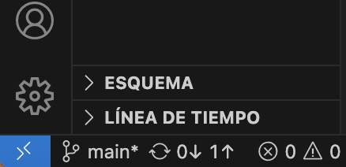

# Proyecto MA3001B

Este proyecto tiene como finalidad analizar los contenidos de un conjunto de CVs para así poder determinar el nivel de jerarquía al cual cada candidato es apto dada la información que expresa en su CV.

Cada CV puede pertenecer a una de las siguientes tres clases:
- Nivel Director
- Nivel Gerente
- Nivel Especialista

## Pre Requisites

Para poder colaborar y correr este proyecto, son necesarias las siguientes herramientas:

- [VScode](https://code.visualstudio.com/)
- [The Dev Container extension](https://marketplace.visualstudio.com/items?itemName=ms-vscode-remote.remote-containers)
- [Docker Desktop ](https://docs.docker.com/desktop/install/mac-install/)

## ¿Cómo activar el contenedor?

Este proyecto trabaja con un entorno virtual de python "dockerizado" con VSCode y la extensión de Dev Container, lo cual permite testear y desarrollar el código dentro del contenedor, resolviendo así los problemas en el versionado de las dependencias del proyecto que se pudieran dar.

El entorno del contenedor se define a través de la carpeta de configuración **.devcontainer**. Es necesario que Docker Desktopo esté activo mientras se trabaja en el proyecto.

### Lanzando el proyecto

Para poder trabjar con el entorno definido, es necesario ir a la parte inferior izquierda de VSCode y dar click en el símbolo (><). Esto abrirá un menú desplegable, en el cual es necesario dar click en la opción "**Volver a abrir en el contenedor**". 

<p align="center">
</a>
</p>

Si funciona correctamente, se debería ver el siguiente mensaje en la terminal:

```bash
Successfully build Docker Container
```

## Correr notebook

La primera vez que se ejecute un notebook, será necesario definir el entorno con el cual trabajará el kernel, es necesario seleccionar **OCR_fase1 (Python 3.9.19)**.

## Main.py

El archivo **Main.py** contiene el script principal del proyecto, mediante el cual se realiza la extracción de características de los CVs.

### Requisitos

Para poder correr el script, es necesario tener en la carpeta raíz un carpeta titulada **CVs**, la cual contiene los archivos correspondientes a los currículums que se deseen analizar, la cual a su vez contiene tres subcarpetas para cada nivel de jerarquía, tituladas correspondientemente: *Nivel Director*, *Nivel Gerente*, *Nivel Especialista*. Las extensiones de archivos admitidos por el momento son **.pdf**, **.doc** y  **.docx**.

### Salidas

Una vez terminada la ejecución del script, se creará el archivo separado por comas **labeled_features.csv**, el cual contiene la información para trabajar con los algoritmos de predicción.
